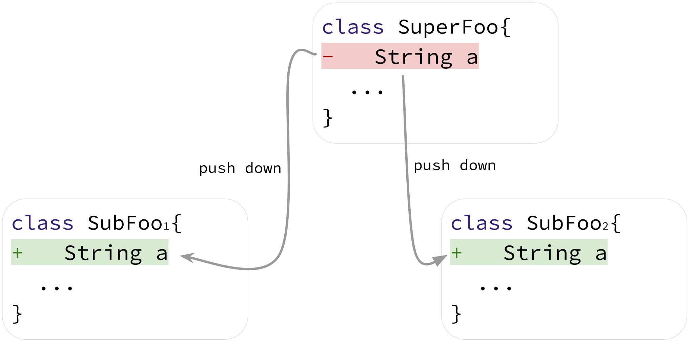

# Towards a Catalog of Composite Refactorings

> Catalogs of refactoring have key importance in software maintenance and evolution, since developers rely on such documents to understand and perform refactoring operations. Furthermore, these catalogs constitute a reference guide for communication between practitioners since they standardize a common refactoring vocabulary. Fowler's book describes the most popular catalog of refactorings, which documents single and well-known refactoring operations. However, sometimes refactorings are composite transformations, i.e., a sequence of refactorings is performed over a given program element. For example, a sequence of Extract Method operations (a single refactoring) can be performed over the same method, in one or in multiple commits, to simplify its implementation, therefore, leading to a Method Decomposition operation (a composite refactoring). In this paper, we propose and document a catalog with eight composite refactorings. We also implement a set of scripts to mine composite refactorings  by preprocessing the results of  refactoring detection tools. Using such scripts, we search for composites in a representative refactoring oracle with hundreds of confirmed single refactoring operations. Next, to complement this first study, we also search for composites in the full history of  ten well-known open-source projects. We characterize the detected composite refactorings, under dimensions such as size and location. 
We conclude by addressing the applications and implications of the proposed catalog.

## Catalog

### Class Decomposition


### Method Decomposition


### Method Composition


### Inline Method


### Pull Up Method


### Push Down Method


### Composite Pull Up Field


### Composite Push Down Field



## Dataset & Scripts

* Scripts to detect composite refactorings are publicly available at:  [detector](detector).

* [Inspected sample](https://github.com/alinebrito/composite-refactoring-catalog/tree/main/results/sample)

* Datasets: [oracle study](results/oracle) and [wild study](results/wild).

## Manuscript

Aline Brito, Andre Hora, Marco Tulio Valente. Towards a Catalog of Composite Refactorings. Journal of Software: Evolution and Process, vol. 1, pages 1-43, 2023. ([arxiv](https://arxiv.org/abs/2201.04599))

```
@article{jsep:2023:CatalogCompositeRefactorings, 
  author = {Aline Brito and Andre Hora and Marco Tulio Valente}, 
  title = {Towards a Catalog of Composite Refactorings}, 
  journal = {Journal of Software: Evolution and Process}, 
  volume = {1}, 
  pages = {1--43},  
  year = {2023}
}
```


