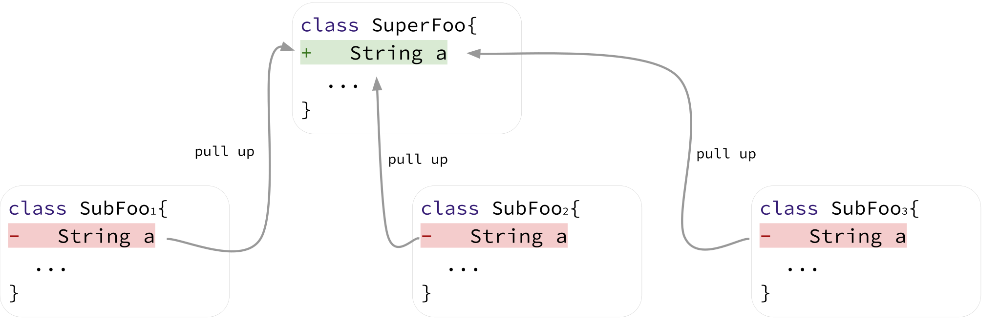

# Towards a Catalog of Composite Refactorings

## Dataset & Scripts

* Scripts to detect composite refactorings are publicly available at:  [detector](detector).

* Datasets: [oracle study](results/oracle), [inspected sample](https://github.com/alinebrito/composite-refactoring-catalog/tree/main/results/sample), [wild study](results/wild).

## Manuscript

Aline Brito, Andre Hora, Marco Tulio Valente. [Towards a Catalog of Composite Refactorings](https://doi.org/10.1002/smr.2530). Journal of Software: Evolution and Process, vol. 1, pages 1-43, 2023.

```
@article{jsep:2023:CatalogCompositeRefactorings, 
  author = {Aline Brito and Andre Hora and Marco Tulio Valente}, 
  title = {Towards a Catalog of Composite Refactorings}, 
  journal = {Journal of Software: Evolution and Process}, 
  volume = {1}, 
  pages = {1--43},  
  year = {2023}
}
```

## Catalog

### Class Decomposition


### Method Decomposition


### Method Composition


### Inline Method


### Pull Up Method


### Push Down Method


### Composite Pull Up Field



### Composite Push Down Field


