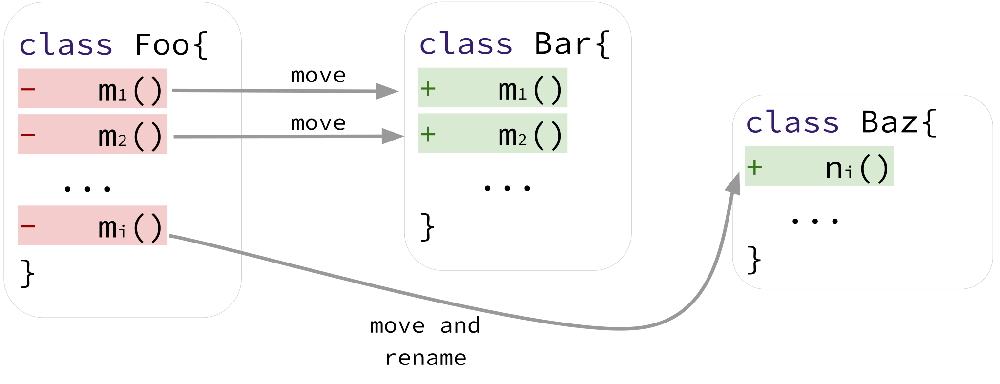
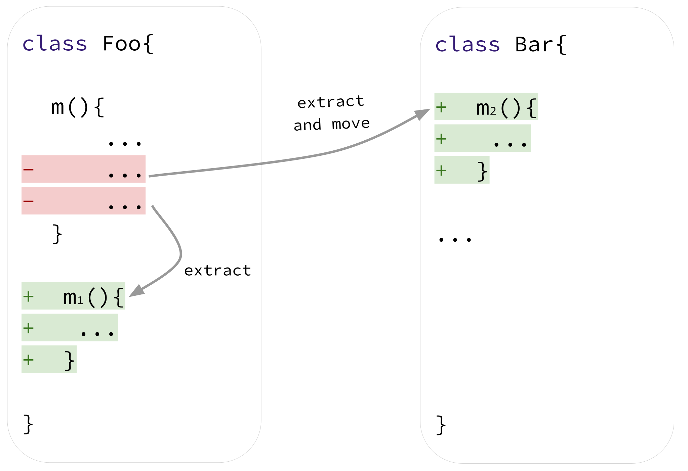
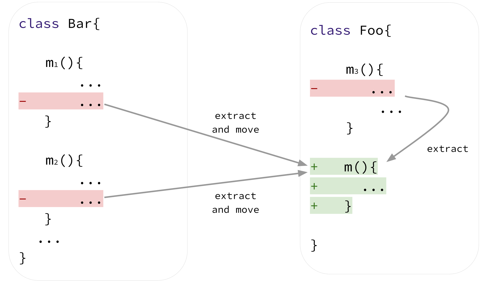
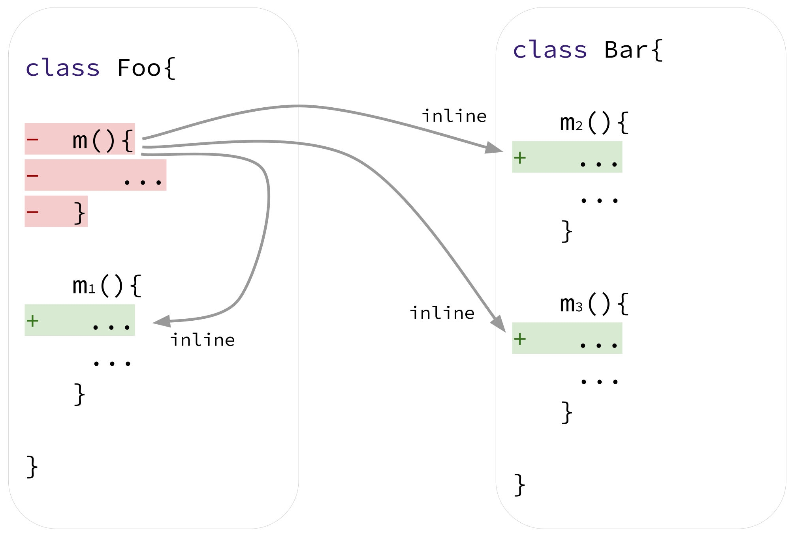
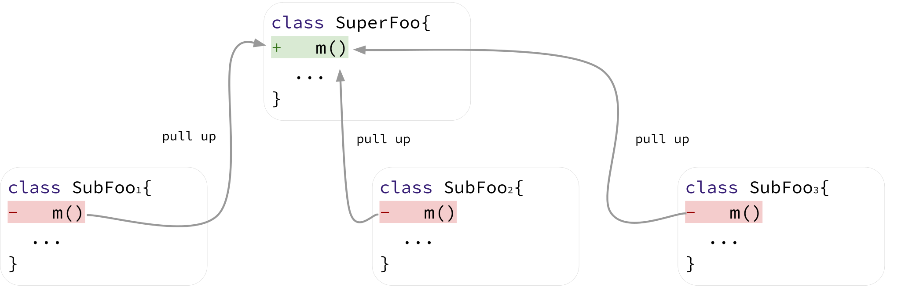
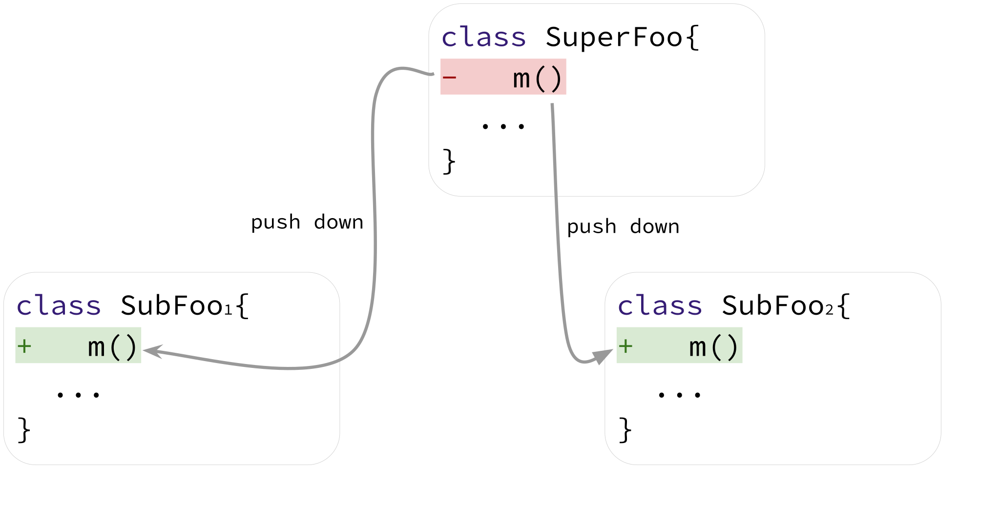

# Towards a Catalog of Composite Refactoring

Scripts to detect composite refactoring are publicly available at: 

## Dataset

Oracle study:

Wild study:

## Catalog of Composite Refactoring

### Class Decomposition

### Method Decomposition

### Method Composition

### Inline Method

### Pull Up Method

### Push Down Method

### Manuscript

Aline Brito, Andre Hora, Marco Tulio Valente. Towards a Catalog of Composite Refactoring. [arxiv](), 2022.

