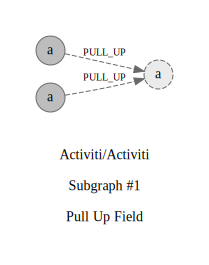

## Refactorings:

id: `0`\
source: `org.activiti.bpmn.model.Activity#boolean.notExclusive`\
target: `org.activiti.bpmn.model.FlowNode#boolean.notExclusive`\
type: `PULL_UP`\
commit: [53036cece](https://github.com/Activiti/Activiti/commit/53036cece662f9c796d2a187b0077059c3d9088a)\
description: `Pull Up Attribute protected notExclusive : boolean from class org.activiti.bpmn.model.Activity to protected notExclusive : boolean from class org.activiti.bpmn.model.FlowNode`

id: `1`\
source: `org.activiti.bpmn.model.Gateway#boolean.notExclusive`\
target: `org.activiti.bpmn.model.FlowNode#boolean.notExclusive`\
type: `PULL_UP`\
commit: [53036cece](https://github.com/Activiti/Activiti/commit/53036cece662f9c796d2a187b0077059c3d9088a)\
description: `Pull Up Attribute protected notExclusive : boolean from class org.activiti.bpmn.model.Gateway to protected notExclusive : boolean from class org.activiti.bpmn.model.FlowNode`