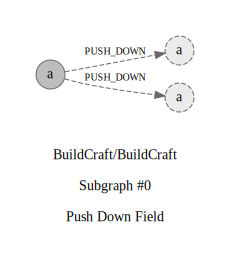

## Refactorings:

id: `0`\
source: `buildcraft.api.robots.ResourceId#BlockIndex.index`\
target: `buildcraft.api.robots.ResourceIdBlock#BlockIndex.index`\
type: `PUSH_DOWN`\
commit: [a5cdd8c4b](https://github.com/BuildCraft/BuildCraft/commit/a5cdd8c4b10a738cb44819d7cc2fee5f5965d4a0)\
description: `Push Down Attribute public index : BlockIndex from class buildcraft.api.robots.ResourceId to public index : BlockIndex from class buildcraft.api.robots.ResourceIdBlock`

id: `1`\
source: `buildcraft.api.robots.ResourceId#BlockIndex.index`\
target: `buildcraft.api.robots.ResourceIdRequest#BlockIndex.index`\
type: `PUSH_DOWN`\
commit: [a5cdd8c4b](https://github.com/BuildCraft/BuildCraft/commit/a5cdd8c4b10a738cb44819d7cc2fee5f5965d4a0)\
description: `Push Down Attribute public index : BlockIndex from class buildcraft.api.robots.ResourceId to private index : BlockIndex from class buildcraft.api.robots.ResourceIdRequest`