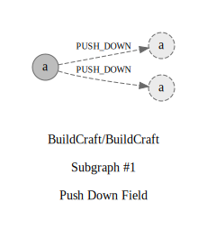

## Refactorings:

id: `0`\
source: `buildcraft.api.robots.ResourceId#ForgeDirection.side`\
target: `buildcraft.api.robots.ResourceIdBlock#ForgeDirection.side`\
type: `PUSH_DOWN`\
commit: [a5cdd8c4b](https://github.com/BuildCraft/BuildCraft/commit/a5cdd8c4b10a738cb44819d7cc2fee5f5965d4a0)\
description: `Push Down Attribute public side : ForgeDirection from class buildcraft.api.robots.ResourceId to public side : ForgeDirection from class buildcraft.api.robots.ResourceIdBlock`

id: `1`\
source: `buildcraft.api.robots.ResourceId#ForgeDirection.side`\
target: `buildcraft.api.robots.ResourceIdRequest#ForgeDirection.side`\
type: `PUSH_DOWN`\
commit: [a5cdd8c4b](https://github.com/BuildCraft/BuildCraft/commit/a5cdd8c4b10a738cb44819d7cc2fee5f5965d4a0)\
description: `Push Down Attribute public side : ForgeDirection from class buildcraft.api.robots.ResourceId to private side : ForgeDirection from class buildcraft.api.robots.ResourceIdRequest`