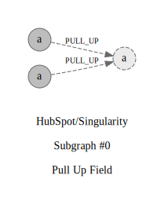

## Refactorings:

id: `0`\
source: `com.hubspot.singularity.resources.DeployResource#SingularityValidator.validator`\
target: `com.hubspot.singularity.resources.AbstractRequestResource#SingularityValidator.validator`\
type: `PULL_UP`\
commit: [45ada13b8](https://github.com/HubSpot/Singularity/commit/45ada13b852af85e1ae0491267a0239d9bdf6f3f)\
description: `Pull Up Attribute private validator : SingularityValidator from class com.hubspot.singularity.resources.DeployResource to protected validator : SingularityValidator from class com.hubspot.singularity.resources.AbstractRequestResource`

id: `1`\
source: `com.hubspot.singularity.resources.RequestResource#SingularityValidator.validator`\
target: `com.hubspot.singularity.resources.AbstractRequestResource#SingularityValidator.validator`\
type: `PULL_UP`\
commit: [45ada13b8](https://github.com/HubSpot/Singularity/commit/45ada13b852af85e1ae0491267a0239d9bdf6f3f)\
description: `Pull Up Attribute private validator : SingularityValidator from class com.hubspot.singularity.resources.RequestResource to protected validator : SingularityValidator from class com.hubspot.singularity.resources.AbstractRequestResource`