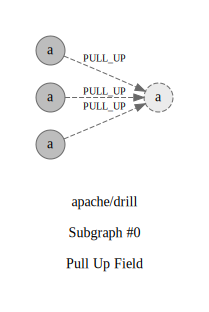

## Refactorings:

id: `0`\
source: `org.apache.drill.exec.impersonation.TestImpersonationDisabledWithMiniDFS#String.MINIDFS_STORAGE_PLUGIN_NAME`\
target: `org.apache.drill.exec.impersonation.BaseTestImpersonation#String.MINIDFS_STORAGE_PLUGIN_NAME`\
type: `PULL_UP`\
commit: [c1b847acd](https://github.com/apache/drill/commit/c1b847acdc8cb90a1498b236b3bb5c81ca75c044)\
description: `Pull Up Attribute private MINIDFS_STORAGE_PLUGIN_NAME : String from class org.apache.drill.exec.impersonation.TestImpersonationDisabledWithMiniDFS to protected MINIDFS_STORAGE_PLUGIN_NAME : String from class org.apache.drill.exec.impersonation.BaseTestImpersonation`

id: `1`\
source: `org.apache.drill.exec.impersonation.TestImpersonationMetadata#String.MINIDFS_STORAGE_PLUGIN_NAME`\
target: `org.apache.drill.exec.impersonation.BaseTestImpersonation#String.MINIDFS_STORAGE_PLUGIN_NAME`\
type: `PULL_UP`\
commit: [c1b847acd](https://github.com/apache/drill/commit/c1b847acdc8cb90a1498b236b3bb5c81ca75c044)\
description: `Pull Up Attribute private MINIDFS_STORAGE_PLUGIN_NAME : String from class org.apache.drill.exec.impersonation.TestImpersonationMetadata to protected MINIDFS_STORAGE_PLUGIN_NAME : String from class org.apache.drill.exec.impersonation.BaseTestImpersonation`

id: `2`\
source: `org.apache.drill.exec.impersonation.TestImpersonationQueries#String.MINIDFS_STORAGE_PLUGIN_NAME`\
target: `org.apache.drill.exec.impersonation.BaseTestImpersonation#String.MINIDFS_STORAGE_PLUGIN_NAME`\
type: `PULL_UP`\
commit: [c1b847acd](https://github.com/apache/drill/commit/c1b847acdc8cb90a1498b236b3bb5c81ca75c044)\
description: `Pull Up Attribute private MINIDFS_STORAGE_PLUGIN_NAME : String from class org.apache.drill.exec.impersonation.TestImpersonationQueries to protected MINIDFS_STORAGE_PLUGIN_NAME : String from class org.apache.drill.exec.impersonation.BaseTestImpersonation`