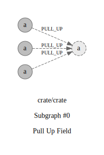

## Refactorings:

id: `0`\
source: `io.crate.planner.node.dql.CollectNode#List<String>.downstreamNodes`\
target: `io.crate.planner.node.dql.AbstractDQLPlanNode#List<String>.downstreamNodes`\
type: `PULL_UP`\
commit: [72b534830](https://github.com/crate/crate/commit/72b5348307d86b1a118e546c24d97f1ac1895bdb)\
description: `Pull Up Attribute private downstreamNodes : List<String> from class io.crate.planner.node.dql.CollectNode to private downstreamNodes : List<String> from class io.crate.planner.node.dql.AbstractDQLPlanNode`

id: `1`\
source: `io.crate.planner.node.dql.join.NestedLoopNode#List<String>.downstreamNodes`\
target: `io.crate.planner.node.dql.AbstractDQLPlanNode#List<String>.downstreamNodes`\
type: `PULL_UP`\
commit: [72b534830](https://github.com/crate/crate/commit/72b5348307d86b1a118e546c24d97f1ac1895bdb)\
description: `Pull Up Attribute private downstreamNodes : List<String> from class io.crate.planner.node.dql.join.NestedLoopNode to private downstreamNodes : List<String> from class io.crate.planner.node.dql.AbstractDQLPlanNode`

id: `2`\
source: `io.crate.planner.node.dql.MergeNode#List<String>.downstreamNodes`\
target: `io.crate.planner.node.dql.AbstractDQLPlanNode#List<String>.downstreamNodes`\
type: `PULL_UP`\
commit: [72b534830](https://github.com/crate/crate/commit/72b5348307d86b1a118e546c24d97f1ac1895bdb)\
description: `Pull Up Attribute private downstreamNodes : List<String> from class io.crate.planner.node.dql.MergeNode to private downstreamNodes : List<String> from class io.crate.planner.node.dql.AbstractDQLPlanNode`